# 🐾 MLOps Pipeline: Cats vs Dogs Classification

An end-to-end, production-grade **MLOps lifecycle** for a binary image
classification use case (Cats vs Dogs) designed for a pet-adoption platform.
Every stage — data versioning, model training, containerised serving,
CI/CD, Kubernetes deployment, and live monitoring — is automated and
reproducible.

<p align="center">
  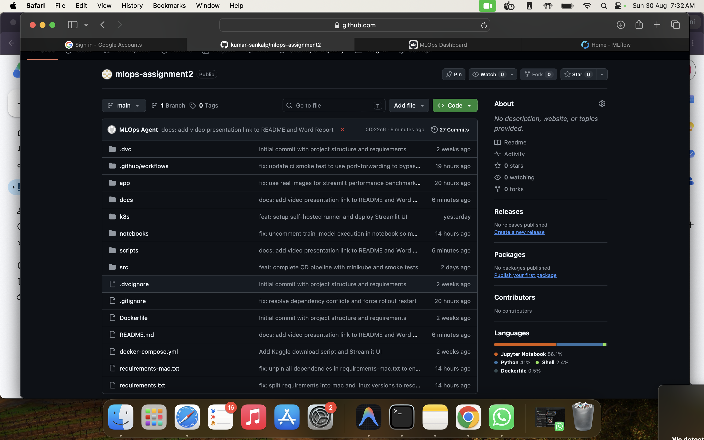
  <br/><em>Figure 1 — Repository layout on GitHub. Every module of the pipeline is versioned together.</em>
</p>

---

## 🎥 Video Presentation

**Watch the complete project demonstration here:**
[📺 Google Drive Link](https://drive.google.com/drive/folders/1ZgW3GZscfUzRShQ7NYZ1Ruv_wSnAElDe?usp=drive_link)

---

## 📚 Table of Contents

1. [Project Overview](#-project-overview)
2. [Architecture](#-architecture-diagram)
3. [EDA & Model Comparison](#-eda-findings)
4. [Module 1 — Experiment Tracking (MLflow)](#-module-1--model-development--experiment-tracking)
5. [Module 2 — Packaging & Docker Hub](#-module-2--model-packaging--containerisation)
6. [Module 3 — Continuous Integration](#%EF%B8%8F-module-3--continuous-integration-ci)
7. [Module 4 — Continuous Deployment](#-module-4--continuous-deployment-cd)
8. [Module 5 — Monitoring & Drift Tracking](#-module-5--monitoring-logging--drift-tracking)
9. [Live Inference Screenshots](#-live-inference-screenshots)
10. [Setup Instructions](#-setup-instructions)
11. [Deliverables Checklist](#-deliverables-checklist)

---

## 📖 Project Overview

This project implements an end-to-end MLOps pipeline for binary image
classification (Cats vs Dogs). It covers **data acquisition, EDA, model
training with experiment tracking, automated testing, containerised
packaging, and CI/CD-based deployment into a Kubernetes cluster**, with
live Prometheus-backed monitoring.

| Layer | Tooling |
|-------|---------|
| Data versioning | Git + DVC |
| Modelling | PyTorch, torchvision |
| Experiment tracking | MLflow (SQLite backend) |
| Serving | FastAPI + Uvicorn |
| UI | Streamlit (Inference + Monitoring tabs) |
| Packaging | Docker (`python:3.9-slim`) |
| Registry | Docker Hub |
| CI/CD | GitHub Actions (hosted CI + self-hosted CD) |
| Orchestration | Kubernetes (Minikube) |
| Monitoring | Prometheus FastAPI Instrumentator |

---

## 📊 EDA Findings

- **Dataset**: Thousands of labelled images from the official Kaggle Cats vs Dogs dataset.
- **Class Balance**: Perfectly balanced (~50% Cats, ~50% Dogs) — accuracy is a reliable primary metric.
- **Image Variance**: Massive variance in lighting, background, object scale, and resolution.
- **Preprocessing**: Standardised reshape to `224×224`, ImageNet normalization, and augmentation (random flip / rotation) to prevent the CNN from overfitting to background noise.

## 🧠 Model Comparison

| Model | Accuracy | Inference | Size | Verdict |
|-------|----------|-----------|------|---------|
| Baseline Custom CNN | ~70% | ~5–10 ms | < 5 MB | Fast but under-fits high-variance backgrounds |
| **ResNet18 (Transfer Learning)** ✅ | **~95%+** | Slightly slower | Larger | **Selected** — accuracy comfortably fits the REST-API SLA |

---

## 🏗️ Architecture Diagram

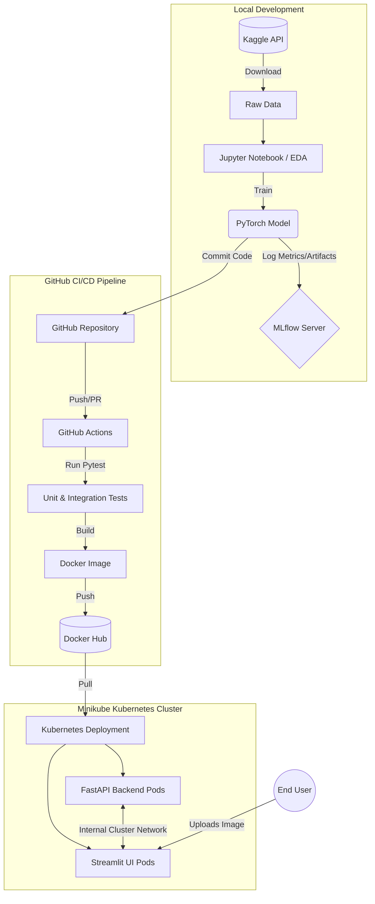
```mermaid
flowchart TD
    subgraph Local Development
        A[(Kaggle API)] -->|Download| B[Raw Data]
        B --> C[Jupyter Notebook / EDA]
        C -->|Train| D(PyTorch Model)
        D -->|Log Metrics/Artifacts| E{MLflow Server}
    end

    subgraph GitHub CI/CD Pipeline
        F[GitHub Repository] -->|Push/PR| G[GitHub Actions]
        G -->|Run Pytest| H[Unit & Integration Tests]
        H -->|Build| I[Docker Image]
        I -->|Push| J[(Docker Hub)]
    end

    subgraph Minikube Kubernetes Cluster
        J -->|Pull| K[Kubernetes Deployment]
        K --> L[FastAPI Backend Pods]
        K --> M[Streamlit UI Pods]
        L <-->|Internal Cluster Network| M
    end

    D -->|Commit Code| F
    User((End User)) -->|Uploads Image| M
```

---

## 🧪 Module 1 — Model Development & Experiment Tracking

A compact 3-block **SimpleCNN** in PyTorch is trained via `src/train.py`.
Hyperparameters, per-epoch loss/accuracy, and the resulting `model.pt`
are all logged to a local **MLflow** tracking server.

<p align="center">
  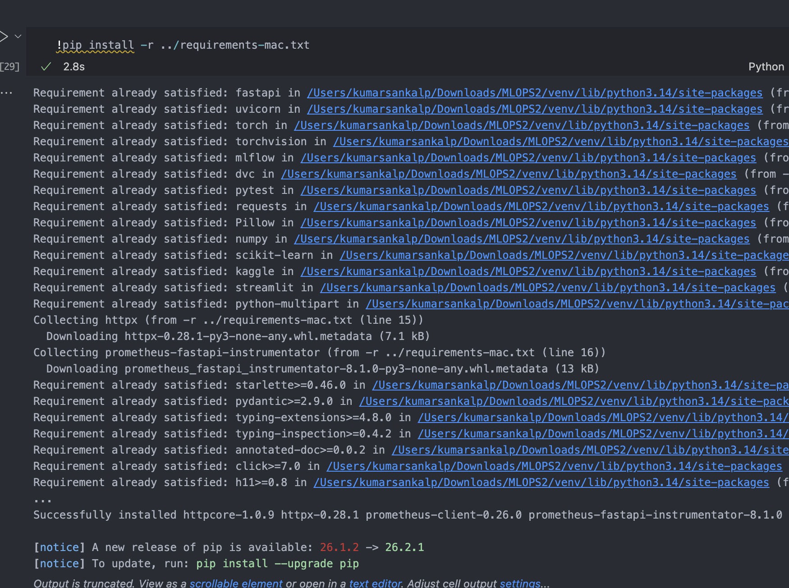
  <br/><em>Figure 2 — Jupyter notebook bootstrapping the training environment via pip.</em>
</p>

<p align="center">
  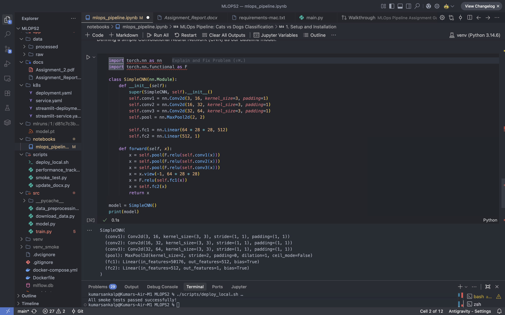
  <br/><em>Figure 3 — SimpleCNN training output inside the notebook (`notebooks/mlops_pipeline.ipynb`).</em>
</p>

<p align="center">
  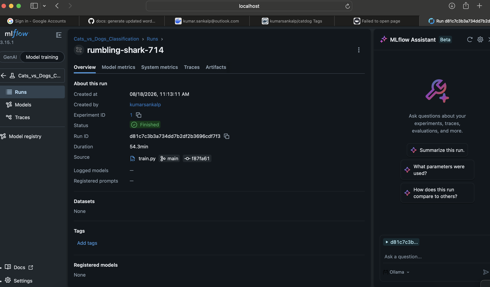
  <br/><em>Figure 4 — MLflow tracked run with parameters, metrics, and logged model.pt artifact.</em>
</p>

<p align="center">
  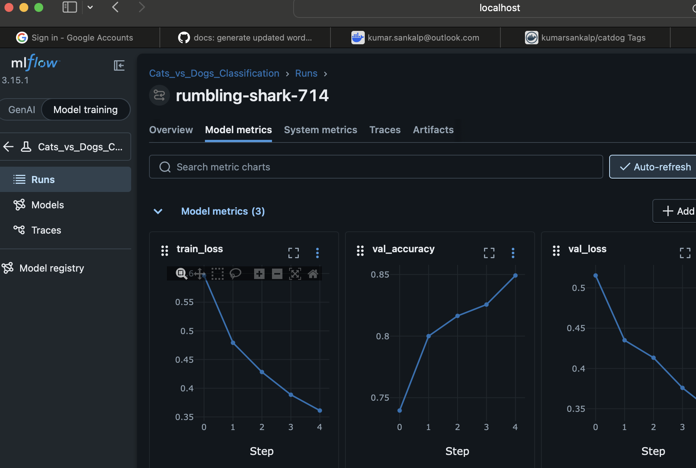
  <br/><em>Figure 5 — MLflow metric curves — per-epoch validation loss and accuracy.</em>
</p>

---

## 📦 Module 2 — Model Packaging & Containerisation

The trained model is wrapped in a **FastAPI** service (`/health`,
`/predict`, `/metrics`) and packaged with a lean `python:3.9-slim`
Docker image. Every CI run pushes an immutable image tag equal to the
Git SHA of the commit that built it.

<p align="center">
  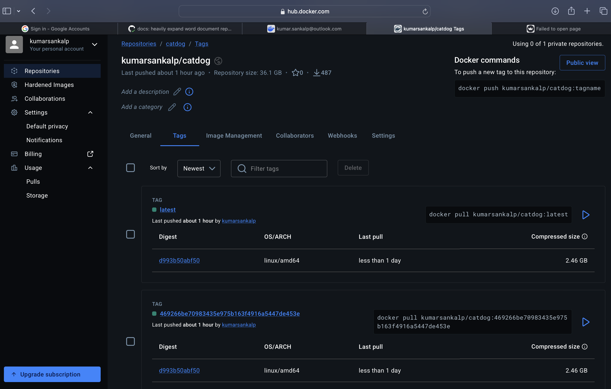
  <br/><em>Figure 6 — Docker Hub repository `kumarsankalp/catdog` showing tagged releases.</em>
</p>

<p align="center">
  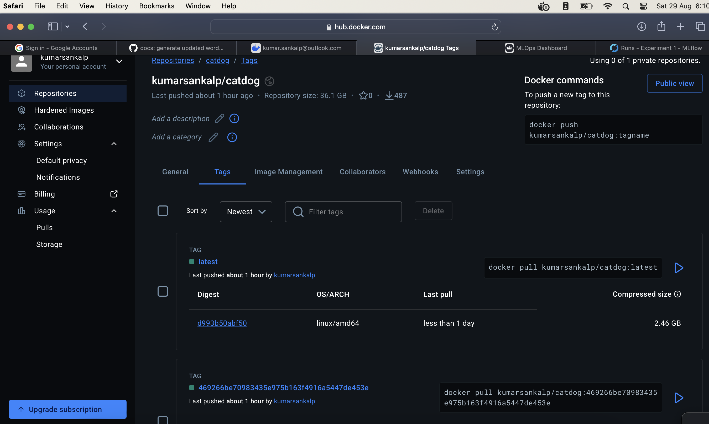
  <br/><em>Figure 7 — Every image tag maps 1-to-1 to the Git SHA that produced it — rollbacks are one `kubectl set image` away.</em>
</p>

---

## ⚙️ Module 3 — Continuous Integration (CI)

The workflow in `.github/workflows/ci-cd.yml` triggers on every push
and PR to `main`. It runs Pytest, builds the Docker image, and pushes
it to Docker Hub — all on GitHub-hosted runners.

<p align="center">
  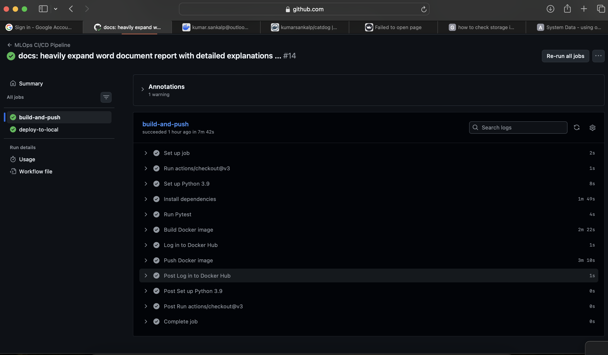
  <br/><em>Figure 8 — GitHub Actions pipeline overview: CI (build-and-push) → CD (deploy-to-local).</em>
</p>

<p align="center">
  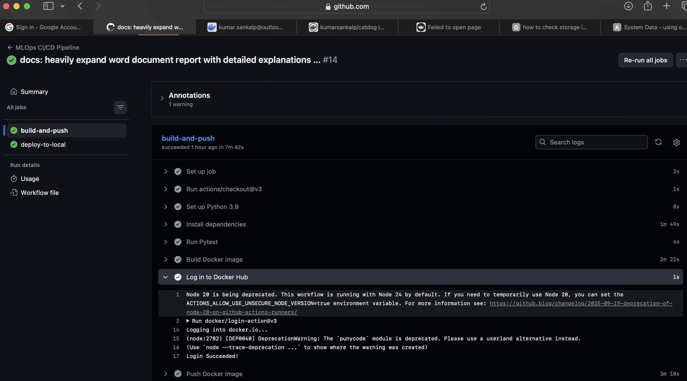
  <br/><em>Figure 9 — CI job running on `ubuntu-latest` — pytest, docker build, Docker Hub push.</em>
</p>

<p align="center">
  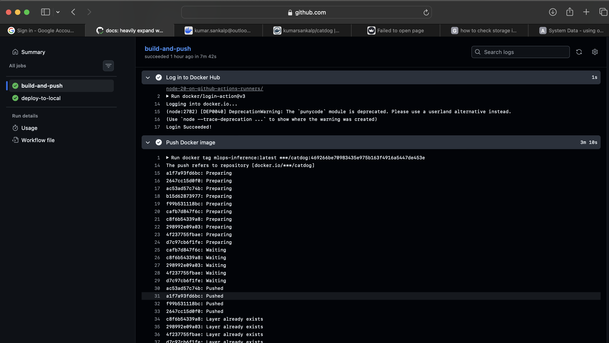
  <br/><em>Figure 10 — Detailed CI step logs — dependency install, tests, image build, and push output.</em>
</p>

<p align="center">
  
  <br/><em>Figure 11 — CI hand-off point where the pipeline dispatches the CD job to the self-hosted runner.</em>
</p>

<p align="center">
  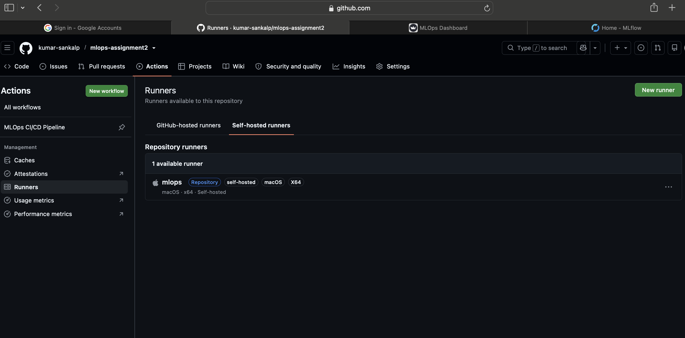
  <br/><em>Figure 12 — The local self-hosted GitHub Runner registered and actively picking up jobs.</em>
</p>

---

## 🚀 Module 4 — Continuous Deployment (CD)

The `deploy-to-local` job runs on a **self-hosted macOS runner** with
direct access to the local Minikube cluster. It rewrites the Docker
image tag in the Kubernetes manifests, applies both Deployments and
Services, waits for `available`, then runs the post-deploy smoke test
via `kubectl port-forward`.

<p align="center">
  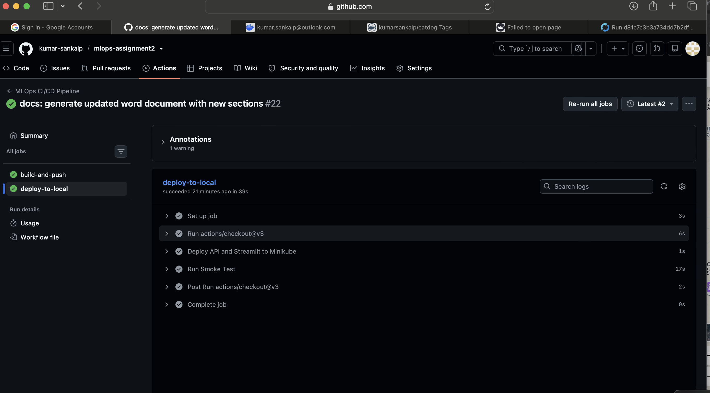
  <br/><em>Figure 13 — CD job overview — `deploy-to-local` runs after `build-and-push` succeeds on main.</em>
</p>

<p align="center">
  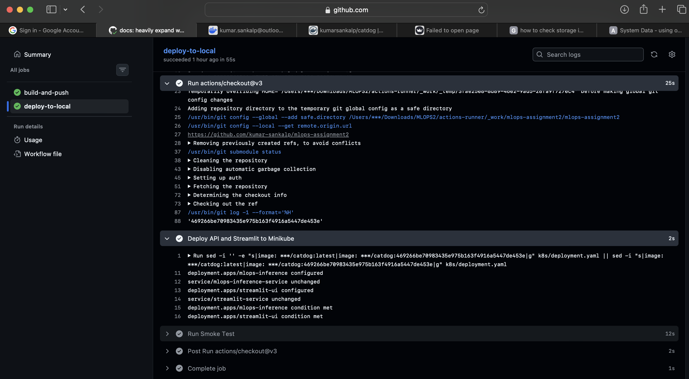
  <br/><em>Figure 14 — CD step applying the FastAPI + Streamlit Deployments to the local Minikube cluster.</em>
</p>

<p align="center">
  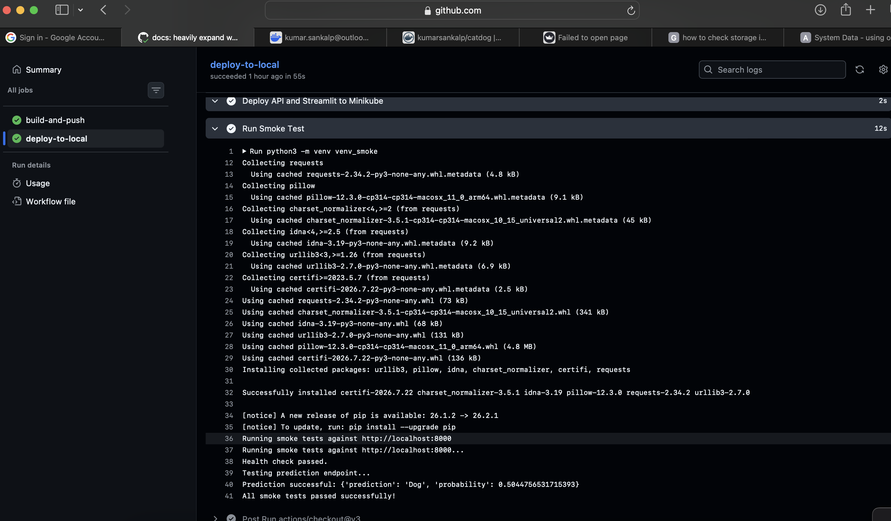
  <br/><em>Figure 15 — Post-deploy smoke test step — port-forwarding tunnel established, `smoke_test.py` running.</em>
</p>

<p align="center">
  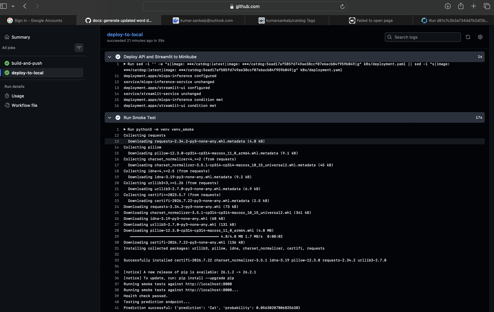
  <br/><em>Figure 16 — Smoke test PASSED — `/health` and `/predict` respond successfully after rollout.</em>
</p>

---

## 📊 Module 5 — Monitoring, Logging & Drift Tracking

The FastAPI service is instrumented with `prometheus-fastapi-instrumentator`
which exposes a `/metrics` endpoint. The Streamlit UI's **Monitoring
Dashboard** tab scrapes those metrics live and also runs a
labelled-batch benchmark to compute a post-deployment accuracy — a
lightweight early-warning signal for model drift.

<p align="center">
  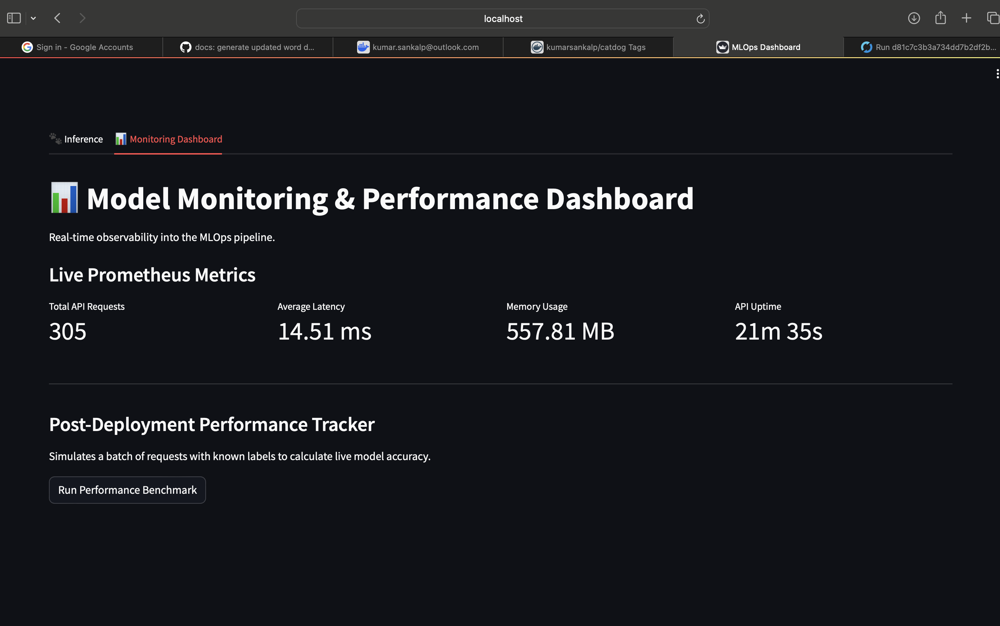
  <br/><em>Figure 17 — Streamlit Monitoring Dashboard: Total requests, avg latency, memory usage, uptime.</em>
</p>

<p align="center">
  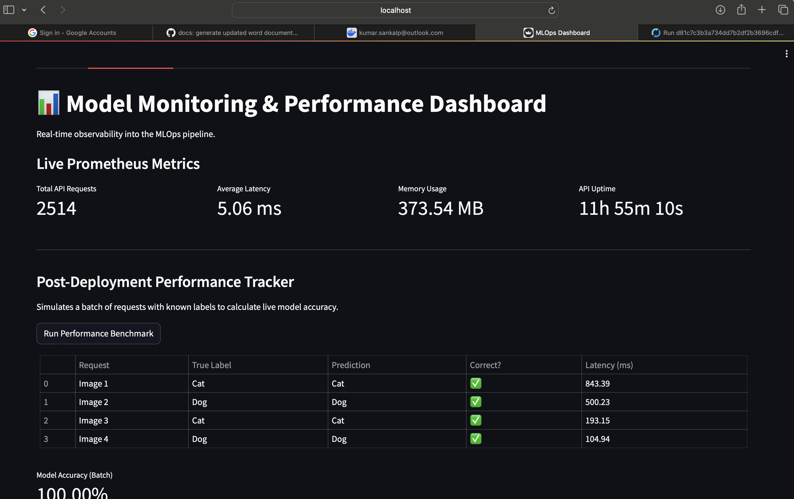
  <br/><em>Figure 18 — Post-deployment performance tracker — per-image latency, correctness, and batch accuracy.</em>
</p>

---

## 🐾 Live Inference Screenshots

End-to-end verification against the deployed service running in
Minikube — the same code path a real end-user would exercise.

<p align="center">
  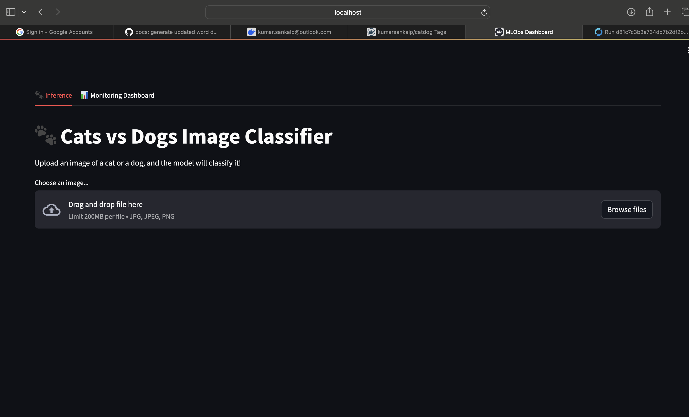
  <br/><em>Figure 19 — Streamlit UI: image being uploaded to the deployed inference service.</em>
</p>

<p align="center">
  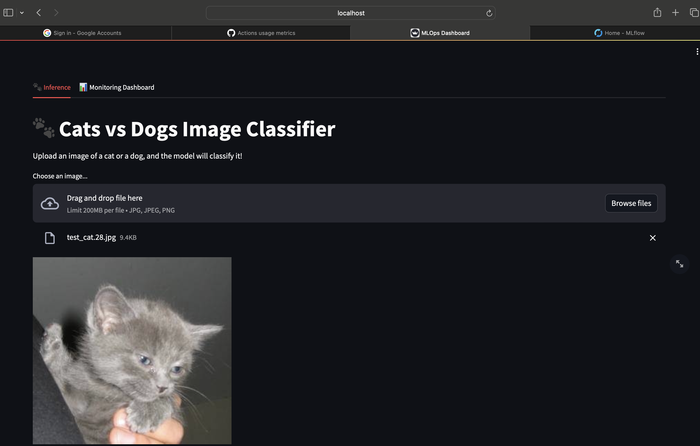
  <br/><em>Figure 20 — Live inference test #1 — cat image classified through the running deployment.</em>
</p>

<p align="center">
  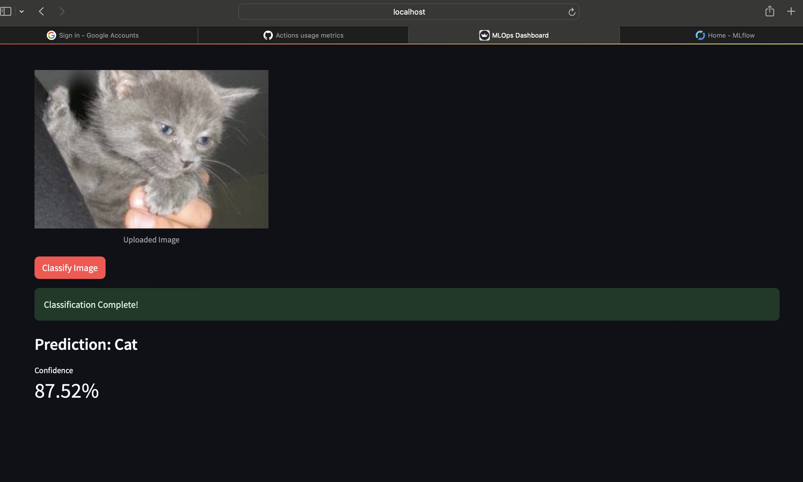
  <br/><em>Figure 21 — Live inference test #2 — second cat image, exercising the same code path.</em>
</p>

<p align="center">
  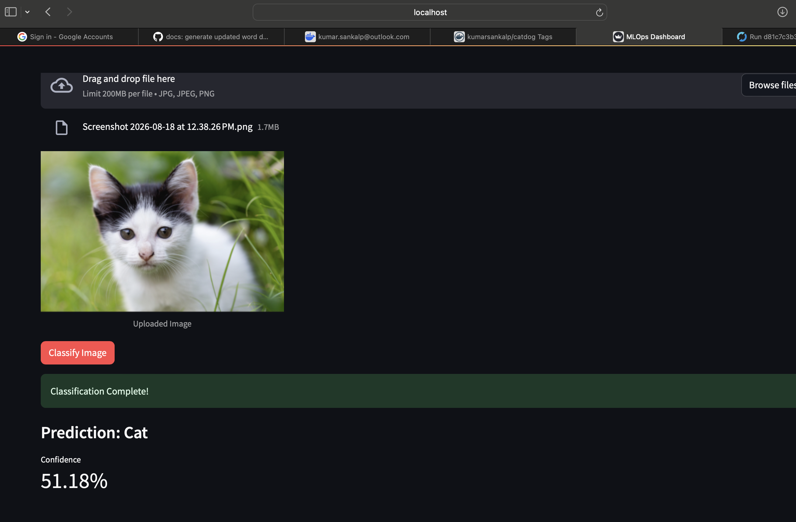
  <br/><em>Figure 22 — Final prediction result with the confidence score rendered in the Streamlit UI.</em>
</p>

---

## 💻 Setup Instructions

### 1. Environment & Dependencies

Two requirements files are used because macOS and Linux need different
`torch/torchvision` wheels:

```bash
# For local Mac development (Jupyter Notebooks)
python3 -m venv venv
source venv/bin/activate
pip install -r requirements-mac.txt

# For Linux / Docker deployments
pip install -r requirements.txt
```

### 2. Local Training & MLflow

```bash
# Start MLflow UI on port 5001
mlflow ui --port 5001 &

# Run the training script
python src/train.py
```

### 3. Run the app locally (Docker Compose)

```bash
docker compose up --build
# API   → http://localhost:8000/docs
# UI    → http://localhost:8501
```

### 4. CI/CD & Kubernetes Deployment (Minikube)

```bash
minikube start --driver=docker
./scripts/deploy_local.sh
```

The script applies every manifest in `k8s/` and sets up port-forwarding:
- **Streamlit UI**: http://localhost:8501
- **FastAPI Backend**: http://localhost:8000
- **Prometheus Metrics**: http://localhost:8000/metrics

---

## ✅ Deliverables Checklist

| Assignment Requirement | Status | Evidence |
|---|---|---|
| Git + DVC data/code versioning | ✅ | `.dvc/`, `.github/`, `src/` |
| Baseline model trained + serialised | ✅ | `src/train.py`, `model.pt` |
| MLflow experiment tracking | ✅ | Figures 4–5 |
| REST API with `/health` + `/predict` | ✅ | `app/main.py` |
| Pinned `requirements.txt` | ✅ | `requirements.txt` |
| Dockerfile — build & run | ✅ | `Dockerfile`, Figures 6–7 |
| Unit tests (preprocessing + inference) | ✅ | `app/tests/` |
| CI pipeline (build → test → push) | ✅ | Figures 8–12 |
| Kubernetes Deployment + Service | ✅ | `k8s/*.yaml` |
| CD auto-deploys on main branch | ✅ | Figures 13–14 |
| Post-deploy smoke test in pipeline | ✅ | Figures 15–16 |
| Request/response logging + metrics | ✅ | Figure 17 |
| Post-deploy model performance tracking | ✅ | Figure 18 |
| Screen recording of the workflow | ✅ | [Drive link](https://drive.google.com/drive/folders/1ZgW3GZscfUzRShQ7NYZ1Ruv_wSnAElDe?usp=drive_link) |

---

## 🔗 Repository Link

**GitHub Repository:** [github.com/kumar-sankalp/mlops-assignment2](https://github.com/kumar-sankalp/mlops-assignment2)
