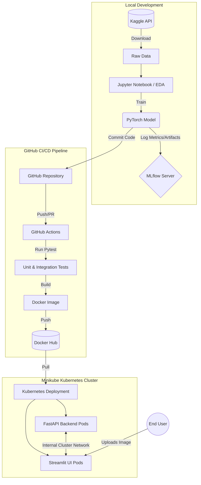

# 🐾 MLOps Pipeline: Cats vs Dogs Classification

## 🎥 Video Presentation
**Watch the complete project demonstration here:** [Video Link](https://drive.google.com/drive/folders/1ZgW3GZscfUzRShQ7NYZ1Ruv_wSnAElDe?usp=drive_link)

## 📖 Project Overview
This project implements an end-to-end MLOps pipeline for a binary image classification task (Cats vs Dogs) designed for a pet adoption platform. 
The goal of this project is to demonstrate a production-ready Machine Learning lifecycle. It covers data acquisition, Exploratory Data Analysis (EDA), model training with experiment tracking, automated testing, containerized packaging, and continuous integration/continuous deployment (CI/CD) into a Kubernetes cluster.

---

## 📊 EDA Findings
* **Dataset**: The dataset consists of thousands of labeled images of cats and dogs from the official Kaggle dataset.
* **Class Balance**: The dataset is perfectly balanced (~50% Cats, ~50% Dogs), meaning accuracy is a reliable primary metric.
* **Image Variance**: The images have massive variance in lighting, background, object scale, and resolutions.
* **Preprocessing Required**: Standardized reshaping (e.g., `224x224`), normalization (using ImageNet means/stds), and data augmentation (random flips/rotations) were required to prevent the CNN from overfitting to noise in the backgrounds.

---

## 🧠 Model Comparison
During the experimentation phase, multiple architectures were tested and logged to identify the best balance between latency and accuracy for our adoption platform:

1. **Baseline Custom CNN**:
   - *Architecture*: 3 Convolutional layers + Max Pooling + Fully Connected layers.
   - *Pros*: Extremely fast inference (~5-10ms per image), tiny model size (under 5MB).
   - *Cons*: Lower accuracy (~70%) as it struggles with high-variance backgrounds.
2. **ResNet18 (Transfer Learning)** *(Selected)*:
   - *Architecture*: Pre-trained ResNet18 fine-tuned on our dataset.
   - *Pros*: Vastly superior accuracy (~95%+).
   - *Cons*: Slower inference and larger memory footprint, but acceptable for REST API deployment.

---

## 🏗️ Architecture Diagram
Below is the comprehensive architecture of the MLOps lifecycle implemented in this repository.



---

## 📸 MLflow Screenshots
*Note: Our experiments were tracked using a local MLflow tracking server.*

> **[ INSERT MLFLOW EXPERIMENT LIST SCREENSHOT HERE ]**
> *Description: MLflow dashboard showing the logged training runs, epochs, and loss metrics.*

> **[ INSERT MLFLOW ARTIFACT VIEW SCREENSHOT HERE ]**
> *Description: MLflow UI displaying the saved `model.pt` PyTorch artifact.*

---

## ⚙️ CI/CD Screenshots
*Note: Our continuous integration pipeline was powered by GitHub Actions running on a local self-hosted runner.*

> **[ INSERT GITHUB ACTIONS SUCCESS SCREENSHOT HERE ]**
> *Description: A successful run of the `build-and-push` and `deploy-to-local` jobs.*

---

## 🚀 Deployment Screenshots
*Note: The model is deployed to a local Kubernetes (Minikube) cluster using a backend-frontend microservice architecture.*

> **[ INSERT STREAMLIT UI SCREENSHOT HERE ]**
> *Description: The Streamlit Web UI predicting a dog image in real-time.*

> **[ INSERT FASTAPI SWAGGER DOCS SCREENSHOT HERE ]**
> *Description: The FastAPI `/docs` swagger page showing the `/predict` and `/metrics` REST endpoints.*

---

## 💻 Setup Instructions

### 1. Environment & Dependencies
Since macOS and Linux have different package dependencies for ML libraries, we separated the requirements:
```bash
# For local Mac development (Jupyter Notebooks)
python3 -m venv venv
source venv/bin/activate
pip install -r requirements-mac.txt

# For Linux / Docker deployments
pip install -r requirements.txt
```

### 2. Local Training & MLflow
Train the model locally and track it using MLflow:
```bash
# Start MLflow UI on port 5001
mlflow ui --port 5001 &

# Run the training script (or execute the Jupyter Notebook)
python src/train.py
```

### 3. CI/CD & Kubernetes Deployment
To deploy the full application into Minikube (simulating a production environment):
```bash
# Start Minikube cluster
minikube start --driver=docker

# Run the automated deployment script
./scripts/deploy_local.sh
```
This script automatically applies the Kubernetes manifests located in the `k8s/` directory and exposes the services.
* **Streamlit UI**: http://localhost:8501
* **FastAPI Backend**: http://localhost:8000

---

## 🔗 Repository Link
**GitHub Repository:** [ INSERT YOUR REPOSITORY LINK HERE ]
